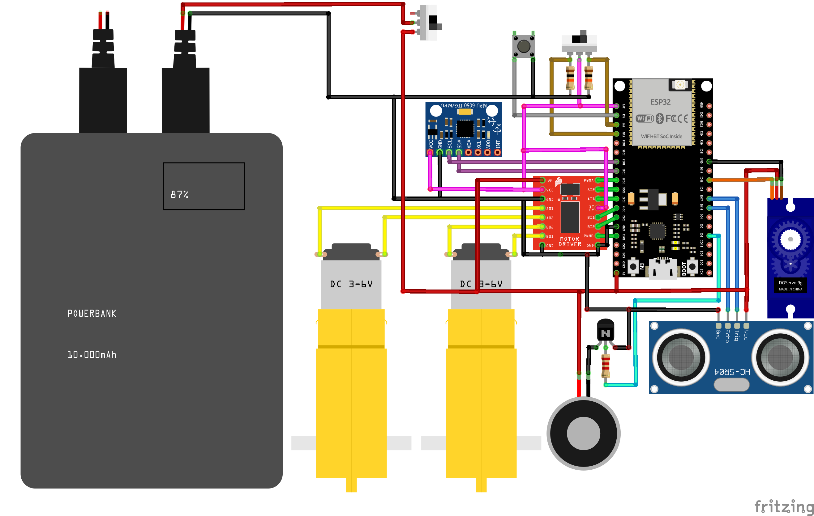
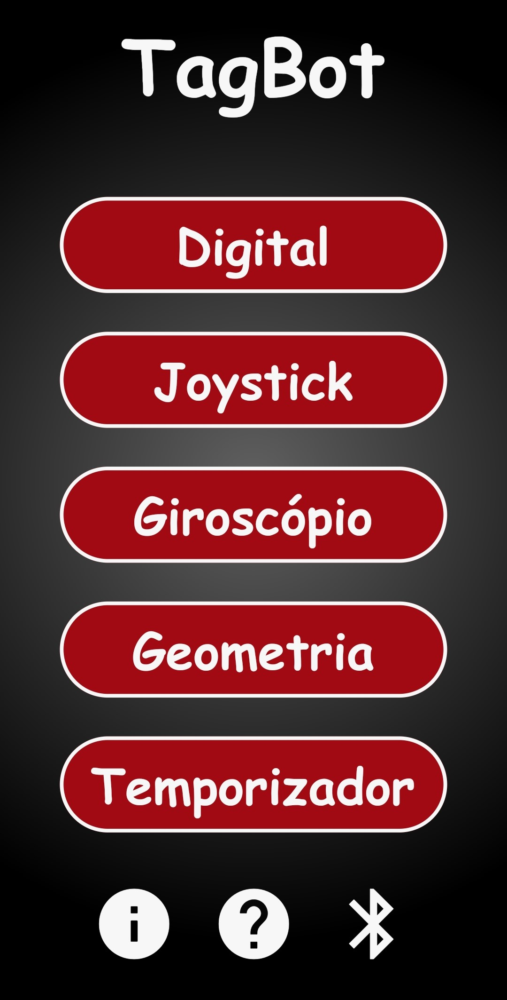
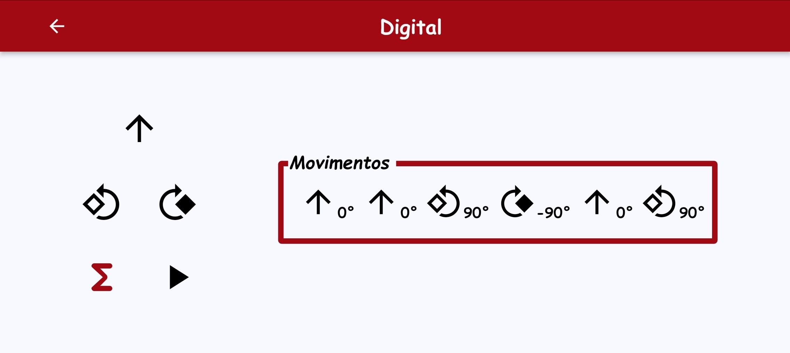
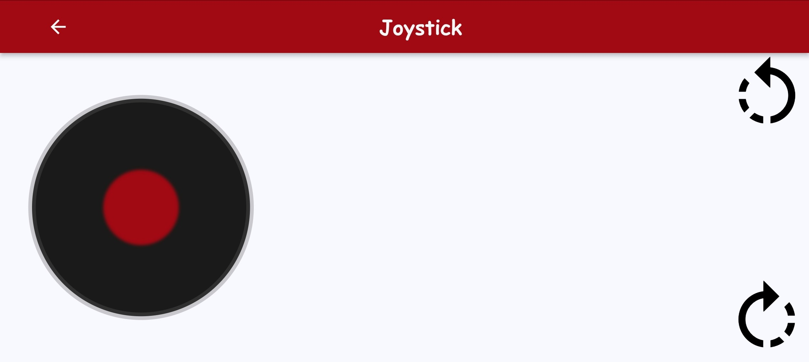
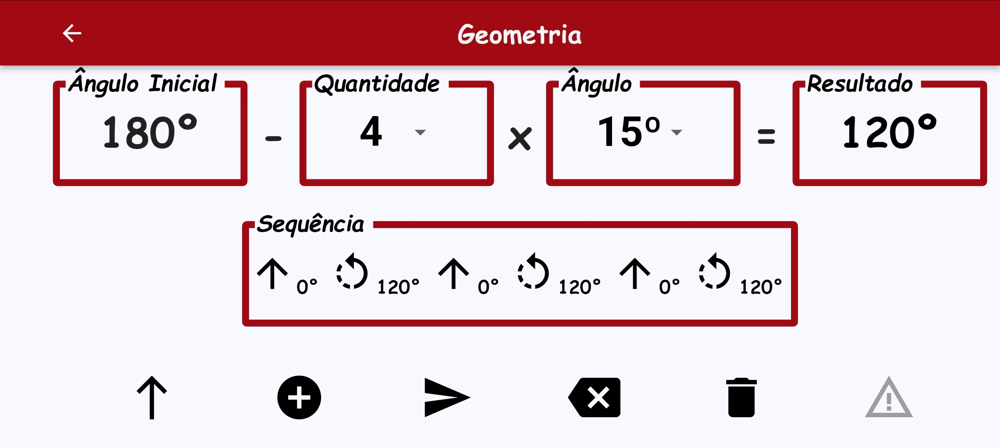
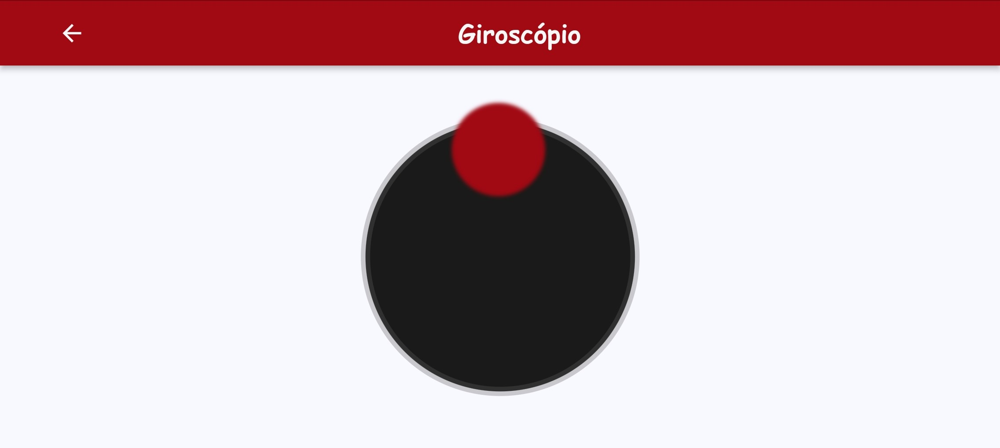
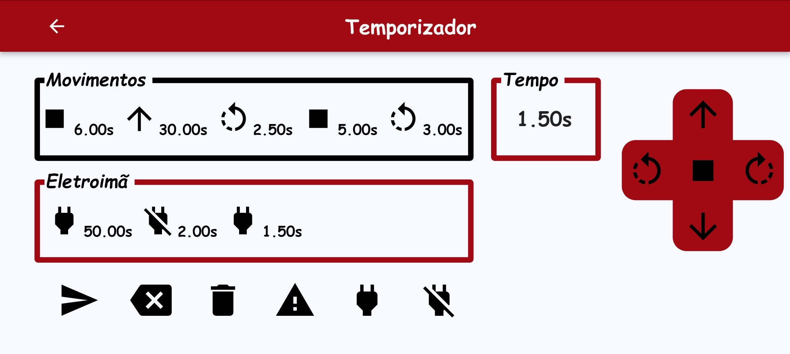

# TagBot Project
TagBot is a project created with the purpose of be used as a tool to teach. It can be controlled by an app called "TagBot" or on its own. This repository contains the robot's C++ code and is under development. Feel free to suggest improvements or report bugs. 

So far, TagBot has been successfully used to teach concepts such as laterality, geometry and kinematics. The robot have three main functionalities: app control, obstacle avoidance without servo motor and obstacle avoidance with servo motor.

## Environment
To program the robot, I used [Arduino](https://www.arduino.cc/en/software) IDE version 2.3.2, with [esp32](https://github.com/espressif/arduino-esp32) version 2.0.11. To upload the code, I used the "**FireBeetle-ESP32**" board with the default parameters, as I couldn't find the "**ESP32-WROOM-32U**" option.

### Third-party libraries:
- [Arduino](https://github.com/arduino) version 2.0.11, to use the standart Arduino functions;
- [NewPing](https://bitbucket.org/teckel12/arduino-new-ping/wiki/Home) version 1.9.7 to communicate with the Ultrasonic Sensor;
- [BluetoothSerial](https://github.com/hen1227/bluetooth-serial) version 2.0.11 to communicate with the APP via Bluetooth Serial communication.

### Custom libraries:
- [Move](https://github.com/MutantHardware/TagBot/tree/main/lib/Move), built to control the robot's movements;
- [Gyroscope](https://github.com/MutantHardware/TagBot/tree/main/lib/Gyroscope), forked from [MPU6050_light](https://github.com/rfetick/MPU6050_light) to measure tilt angle;
- [ESP32Servo](https://github.com/MutantHardware/TagBot/tree/main/lib/ESP32Servo), forked from [ESP32Servo](https://github.com/jkb-git/ESP32Servo) to control the servo movements;
- [Switch](https://github.com/MutantHardware/TagBot/tree/main/lib/Switch), designed to detect the position or changes of the switch;
- [Electromagnet](https://github.com/MutantHardware/TagBot/tree/main/lib/Electromagnet), created to control the state of the robot's electromagnet;
- [Sequence](https://github.com/MutantHardware/TagBot/tree/main/lib/Sequence), developed to control the sequence of movements and the states of the electromagnet;
  
:warning: **Watchout**: Make sure to update the old functions if you're using newer versions of the libraries!

## Improvement points
- Add OTA through bluetooth can be a good option.
- The IMU has a lot of drift and I recommend using it with an encoder for better odometry;
- Changing the communication from Bluetooth serial to BLE will make the code clearer and save energy;
- The "NewPing" library allows only one GPIO to be used to control the ultrasonic sensor, so you can use it to free up the other GPIO;
- To achieve better results with the obstacle avoidance, I suggest calculating the robot's velocity and using sensor fusion with the IMU;
- I used timer-based scheduling to mimic simultaneous actions, but to really achieve this and more efficient code, you should use RTOS.

## Electrical Diagram
The componentes used to make the electrical part of the robot was:

- Wires;
- 1 Push button;
- 1 Switch ON/OFF;
- 1 H-bridge TB6612FNG;
- 1 Electromagnet 20mm;
- 1 Micro Servo 9g SG90;
- 1 Transistor NPN BC548;
- 1 ESP32-WROOM-32U board;
- 2 Motors DC with gearbox;
- 1 Resistor with 2.2K OHM;
- 2 Resistors with 10K OHM;
- 1 Switch with 3 positions;
- 1 Ultrasonic sensor HC-SR04;
- 1 Power Bank 20.000mAh with 3.1A Max;
- 1 Gyroscope and accelerometer MPU-6050.

The basics of the wiring can be seen below:

<div align="center">
  
</div>

## Obstacle Avoidance
The obstacle avoidance logic uses the ultrasonic sensor in front of the robot to detect whether the robot is going to crash. If the toggle switch is in the first position, the robot operates only with the ultrasonic sensor pointed straight ahead. If the toggle switch is in the second position, the robot rotates the ultrasonic sensor by a preset angle using the servomotor, clockwise and counterclockwise, and decides where to go.

## TagBot App
The application has been developed to work with Android devices and communicate with the robot via Bluetooh Serial. The app will soon be deployed for free on the Google Play platform.

### Home Page
The home page offers the following options:

- Button to send project feedback.
- Button to see credits and software licenses.
- Buttons to control the robot in different ways.
- Button to activate or deactivate device's bluetooth.

<p align="center">
  
</p>

### "Digital" Mode
Allows the user to move or record a sequence of movements for the robot to perform, using arrows on the screen. The purpose of this mode was to teach laterality, with the robot moving forward and rotating 90º clockwise or counterclockwise.

<p align="center">
  
</p>

### "Joystick" Mode
In this mode, the user can control robot's translation, dragging the joystick. In addition, the user can press a button to rotate robot around it's own axis, clocwise or counterclocwise.

<p align="center">
  
</p>

### "Geometria" Mode
Allows the user to execute a sequence with the supplementary angle of the result of a multiplication between an angle and a numerical value, as well as moving forward. Other actions availables are delete sequence last element, delete all elements of the sequence and stop the robot during it's execution.

<p align="center">
  
</p>

### "Giroscópio" Mode
This control mode uses the tilt around the X and Y axis of the device's gyroscope to control the PWM values of the robot's wheels.

<p align="center">
  
</p>

### "Temporizador" Mode
In this mode, the user can enter a sequence of movements or activation and deactivation of the electromagnet with the selected time, using the buttons in the screen. Both actions work simultaneously. In addition, there are buttons to delete the last element or all the elements in the highlighted area, send the command to the robot to start or stop the sequence during its operation. 

<p align="center">
  
</p>

## Cite TagBot
To cite this project in publications, add this snippet to your BibTex file:

```bibtex
@misc{TagBot,
  author = {João Grando},
  title = {TagBot},
  year = {2024},
  publisher = {GitHub},
  note = {GitHub Repository},
  howpublished = {\url{https://github.com/MutantHardware/TagBot/}},
}
```

## Acknowledgements
Thanks to the [NERo](https://github.com/neroUFV) team for the support and making this project possible.

## Copyright & License
This project is under [MIT License](LICENSE). Read the "LICENSE" file for details.